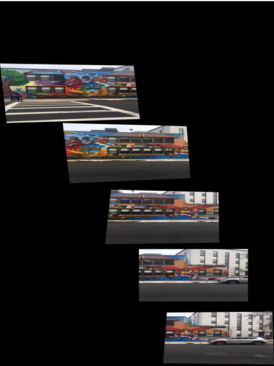
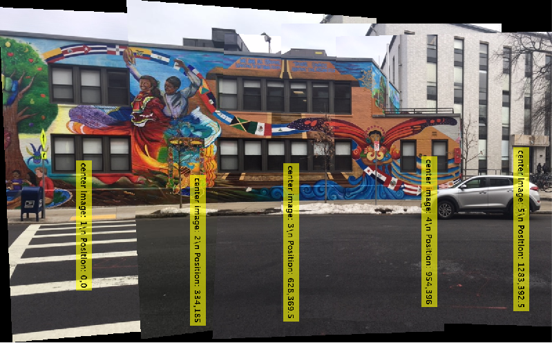

# photomosaic
Program that takes overlapping images and converts them into a combined photomosaic image. Uses Matlab and the Camera Calibration Toolbox to consider the intrinsic camera parameters. Detects the matching features and homography between overlapping images and then blends the area in the image. 

## Software Required
* MATLAB
* Camera Calibration Toolbox

## Results

#### Input Images
      

#### Output Photomosaic Image
    
